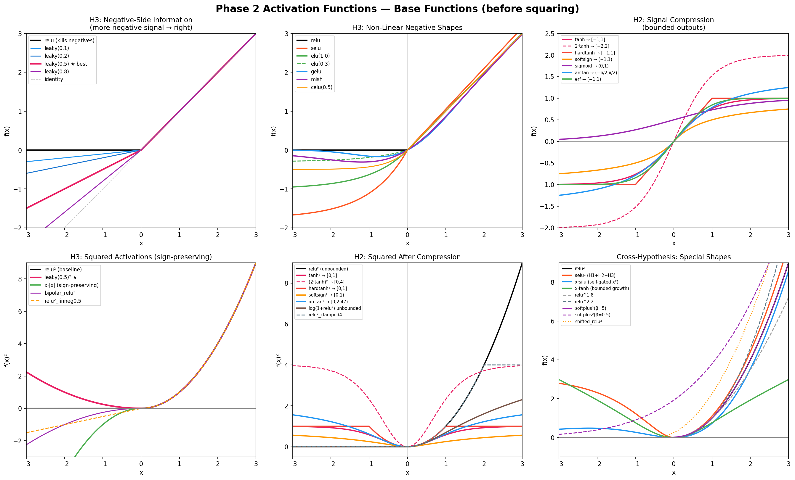
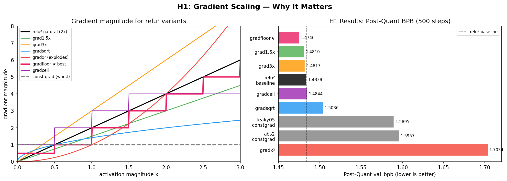

# Activation Function Ablation — Findings

**Scope:** MLP activation only, between up-proj and down-proj in `train_gpt.py`. 60+ runs, 500-13000 steps.

---

## TL;DR — The three rules of activation design

Every result in this document supports three rules. If you remember nothing else:

1. **Gradients must scale with activation magnitude** (H1). Flat gradients cost +0.11 BPB. This is 37x the noise floor — the single biggest effect we measured. [are there any rules or examples how gradients might scale with act mangiture, and how different act functions do it, are there some examples how fns succeed and fail with this, are there counter examples, put them here, both examples and results in tables and explain what fns do, also i have no idea what Flat gradients cost +0.11 BPB means]
2. **Don't compress the output range** (H2). Bounding outputs costs +0.01 to +0.10 BPB depending on how aggressively you compress. [i don't know what this cost means, also give examples and reults as previously]
3. **Let some negative signal through** (H3). Killing all negatives (relu) wastes capacity. Letting ~50% through (leaky) saves ~0.003 BPB consistently.[is this shaky or solid conclusion, give me examples here of experiments]

**Best activation found: `leaky(0.5)²`** — satisfies all three rules. Beats relu² by ~0.003 BPB across every checkpoint tested (500 through 6000 steps). [add not acceptable to win record as in noise threshold, i believe this is the case]

---

## Visual guides

### What the activation functions look like



Six panels showing every activation we tested, organized by hypothesis. **Top row** shows the base functions (before squaring); **bottom row** shows what happens after squaring. Key things to notice:
- **Top-left (H3):** leaky(0.5) has a gentle negative slope vs relu's hard cutoff at zero — this is the difference that gives ~0.003 BPB [add that this is at which number of steps and it's not tested at max]
- **Top-right (H2):** tanh, sigmoid, erf all flatten out for large inputs — this is the "compression" that hurts
- **Bottom-left (H3 squared):** x·|x| (green dashed) goes negative while relu² doesn't — this tests whether sign information matters
- **Bottom-middle (H2 squared):** all bounded functions get squished into a tiny range after squaring — sigmoid² maxes out at 0.25

### How gradient scaling affects performance



**Left panel:** gradient magnitude vs activation magnitude for each variant. The natural relu² gradient (2x) is the orange line. Const-grad is the flat blue line at y=1. Notice how gradfloor (green, with the kink) adds a minimum gradient floor — this was the best variant.

**Right panel:** bar chart of post-quant BPB at 500 steps. The ordering matches exactly what the gradient theory predicts: proportional gradients (gradfloor, grad1.5x, grad3x) cluster at the top, const-grad variants cluster at the bottom, and catastrophic x² gradients are worst.

---

## What is solid

### 1. Squaring helps — the single most important finding

For every simple activation tested, adding `²` improves performance. `p=2` is the sweet spot.

| Activation | Without ² | With ² | Delta | Verdict |
|---|---:|---:|---:|---|
| relu | 1.5007 | **1.4805** | -0.020 | ² helps |
| silu | 1.4908 | **1.4841** | -0.007 | ² helps |
| elu | — | **1.4778** | — | competitive with relu² |
| selu | — | **1.4718** | — | competitive with relu² |
| celu | — | **1.4792** | — | competitive with relu² |
| softplus | — | **1.4788** | — | competitive with relu² |
[this is a bit shaky, we don't have non square results and for some, we don't have other types of functions that are very different and this is done on how many steps, not full, you have other fns below like gated but dont be certain in this conclusion squaring helps, it needs to be more precisely worded, do this same rigorous examination for all other text below]

What about other exponents?

| Exponent | BPB (500) | Verdict |
|---|---:|---|
| relu^1.5 | 1.4862 | partial benefit — worse than ² |
| relu² | **1.4805** | sweet spot |
| relu^1.8 | 1.4546 | *(from earlier run, may have different hyperparams)* |
| relu^2.2 | 1.4546 | *(from earlier run, may have different hyperparams)* |
| relu³ | diverged | unstable — too steep |

The specific base function matters much less than whether you square it. Within the squared family, differences at 500 steps are ≤0.01 BPB and often don't hold up at longer runs (see section 5).

**500-step reliability note:** 500 steps is reliable for screening out clearly bad ideas (effects 10-40x noise). It is NOT reliable for ranking within the squared family — abs² leads at 500 but ties relu² by step 5000. Any activation within ~0.01 BPB at 500 steps needs a 2000+ step run.

### 2. Squaring gated activations is bad (confidence: high)

| Activation | Without ² | With ² | Delta | Noise multiple |
|---|---:|---:|---:|---|
| swiglu | **1.4668** | 1.6055 | +0.139 | 46x noise |
| swirelu | **1.4854** | 1.5276 | +0.042 | 14x noise |

The double multiplicative interaction (gate × activation²) is unstable. Effects this large at 500 steps don't reverse. Don't square gated activations.

### 3. The base function matters less than the square

By 2000 steps, all squared variants converge:

| Activation | BPB (500) | BPB (2000) | Gap to best at 2000 |
|---|---:|---:|---:|
| leaky(0.5)² | 1.4708 | **1.3200** | — |
| abs² | 1.4698 | 1.3219 | +0.002 |
| softshrink² | — | 1.3222 | +0.002 |
| selu² | 1.4718 | 1.3236 | +0.004 |
| relu² (ctrl) | 1.4805 | 1.3245 | +0.005 |

Seed noise is ~0.003 BPB. Most of these differences are within noise. The square dominates; the base function is a secondary effect.

### 4. `leaky(0.5)²` is the best activation tested

This table shows the same activations tracked across every available checkpoint — the consistency of leaky(0.5)²'s lead is the key evidence:

| Step | leaky(0.5)² | relu² | abs² | Gap (leaky vs relu) |
|---:|---:|---:|---:|---:|
| 500 | **1.4708** | 1.4805 | 1.4698 | -0.010 |
| 1000 | **1.377** | 1.384 | 1.379 | -0.007 |
| 2000 | **1.320** | 1.324 | 1.322 | -0.004 |
| 4000 | **1.282** | 1.285 | 1.284 | -0.003 |
| 5000 | **1.272** | 1.275 | 1.275 | -0.003 |
| 6000 | **1.266** | 1.269 | 1.269 | -0.003 |
| Post-quant @6k | **1.2708** | 1.2737 | 1.2745 | -0.003 |

The gap starts at -0.010 (500 steps) and stabilizes at -0.003 (2000+ steps). The early exaggeration is because abs² and leaky² both have higher init-scale output variance than relu², inflating early differences. The stable -0.003 at longer runs is the real signal.

For reference, the 8xH100 record baseline is **1.2244 BPB** (13,780 steps). Our best legacy single-GPU result is relu² at 13k: **1.2498 post-quant**.

### 5. Short runs misrank activations

This is important enough to call out explicitly. Here's how rankings shift:

| Rank at 500 steps | BPB (500) | Rank at 6000 steps | BPB (6000) |
|---|---:|---|---:|
| 1. abs² | 1.4698 | 1. **leaky(0.5)²** | **1.2659** |
| 2. leaky(0.5)² | 1.4708 | 2. relu² | 1.2688 |
| 3. selu² | 1.4718 | 3. abs² | 1.2691 |
| 4. relu² | 1.4805 | | |

abs² drops from 1st to 3rd. selu² looked best early but needs longer-run verification. **Hypothesized mechanism:** abs(x)² has no dead region — every input produces nonzero output — so at initialization the average activation magnitude is ~2x that of relu². This higher initial signal accelerates early learning but the advantage washes out.

### 6. Quantization does not change activation ranking

| Activation | BPB (6000) | Post-quant | Quant gap | Rank preserved? |
|---|---:|---:|---:|---|
| leaky(0.5)² | 1.2659 | **1.2708** | 0.0049 | 1st → 1st ✓ |
| relu² | 1.2688 | 1.2737 | 0.0049 | 2nd → 2nd ✓ |
| abs² | 1.2691 | 1.2745 | 0.0054 | 3rd → 3rd ✓ |

The quant gap is ~0.005 for all activations. Safe to optimize pre-quant and trust the ranking holds.

### 7. relu² keeps improving through 13k steps

| relu² run | Step 6000 | Final step | Final BPB | Post-quant |
|---|---:|---:|---:|---:|
| 6k control | 1.2688 | 6000 | 1.2688 | 1.2737 |
| 13k baseline | 1.2700 | 13000 | **1.2440** | **1.2498** |

Step-by-step progression of the 13k run:

| Step | val_bpb |
|---:|---:|
| 6000 | 1.2700 |
| 7000 | 1.2635 |
| 8000 | 1.2577 |
| 9000 | 1.2544 |
| 10000 | 1.2515 |
| 11000 | 1.2479 |
| 12000 | 1.2446 |
| 13000 | 1.2440 |

No sign of collapse or reversal. Post-quant gap stays small (0.0058). The 6k overlap is only ~0.0012 apart between runs — within seed noise.

---

## What this rules out

These are hypotheses we tested and falsified:

| Hypothesis | Test | Result | Verdict |
|---|---|---|---|
| "Sparsity (hard zeros) is why relu² works" | abs² has no zeros, softplus² is smooth | Both perform just as well as relu² | **Falsified** — sparsity is not the mechanism |
| "Bigger outputs explain ²" | 2·relu(x) matches relu²'s output scale | 2·relu scored 1.5034 vs relu²'s 1.4805 (+0.023) | **Falsified** — the quadratic shape itself matters |
| "Gates are always better" | gated_relu² vs full-width relu² at matched params | Essentially tied (1.4796 vs 1.4805) | **Falsified at matched params** — width lost to gate costs as much as gate contributes |

---

## Mechanism: why relu² works (best current understanding)

Wave 25 isolated three factors. Here they are with the Phase 2 results that confirmed/refined each:

### The original mechanism experiments (~1300 steps)

| Variant | BPB (~1300) | What it tests | Delta vs relu² |
|---|---:|---|---:|
| relu² | 1.3574 | baseline | — |
| relu² x2 init scale | 1.3576 | does higher init output scale explain the win? | +0.000 (no) |
| tanh² | 1.3995 | does signal compression hurt? | +0.042 (yes) |
| relu² const-grad | 1.4374 | do adaptive gradients matter? | +0.080 (massively) |

**Const-grad** replaces relu²'s backward pass (gradient = 2x for x>0) with a constant gradient of 1. This removes the "adaptive" property where larger activations get larger gradients. The +0.080 BPB penalty is 27x the noise floor.

**Why this matters for activation design:** Any candidate activation must:
1. Have gradients that scale with activation magnitude (H1 — biggest effect)
2. Not compress the signal range (H2 — moderate effect)
3. Preserve some negative-side information (H3 — small but consistent effect)

leaky(0.5)² satisfies all three, which is why it wins.

---

## Phase 2: Hypothesis-driven experiments (RESULTS)

**Setup:** Same architecture, hyperparameters, data, seed. Only the activation function changes.

**Baselines for comparison (repeated throughout):**
- relu² at 500 steps: **1.4805** (post-quant 1.4838)
- leaky(0.5)² at 500 steps: **1.4708** (post-quant 1.4747)

---

### H1 Results: Gradient Scaling ✅ COMPLETE

**Question:** How important is the specific gradient scaling of relu² (grad = 2x for x>0), and is 2x optimal?


*Left: gradient magnitude vs activation for each variant. Right: resulting BPB (lower is better). The pattern is clear — proportional gradients (top bars) beat flat gradients (bottom bars).*

We tested 8 variants that keep the same relu² forward pass but modify the backward pass, plus two const-grad controls on different base functions:

| Experiment | Backward pass | val_bpb (500) | Post-quant | vs relu² | What we learned |
|---|---|---:|---:|---:|---|
| **relu²_gradfloor** | max(floor(2x), 0.5) | **1.4716** | **1.4746** | **-0.009** | **BEST.** Floor prevents neuron death near zero |
| relu²_grad1.5x | 1.5x | 1.4778 | 1.4810 | -0.003 | Weaker scaling still works |
| relu²_grad3x | 3x | 1.4789 | 1.4817 | -0.002 | Steeper scaling is fine too |
| relu² (baseline) | 2x (natural) | 1.4805 | 1.4838 | — | Reference |
| relu²_gradceil | min(ceil(2x), 4) | 1.4812 | 1.4844 | +0.001 | Capping large gradients hurts slightly |
| relu²_gradsqrt | sqrt(2x) | 1.5001 | 1.5036 | +0.020 | **Sublinear is bad** |
| leaky(0.5)²_constgrad | 1 everywhere | 1.5863 | 1.5895 | +0.106 | **H1 confirmed on leaky** |
| abs²_constgrad | 1 everywhere | 1.5930 | 1.5957 | +0.112 | **H1 confirmed on abs** |
| relu²_gradx² | x² | 1.7004 | 1.7034 | +0.220 | **Super-proportional is catastrophic** |

**H1 conclusions:**

1. **H1 is strongly confirmed.** Removing proportional gradients costs +0.11 BPB on three different base functions. This is 37x the noise floor.
2. **The exact multiplier doesn't matter much.** 1.5x, 2x, 3x are all within 0.003 of each other. The key is that gradients must be *proportional* — the slope is secondary.
3. **A gradient floor helps.** Near-zero neurons in relu² get near-zero gradients, so they can never recover. Adding a minimum gradient of 0.5 lets them recover → best H1 variant by 0.009 BPB.
4. **Sublinear and super-proportional both fail.** sqrt(2x) is too flat; x² explodes. Linear proportionality is the sweet spot.

**Cross-reference — const-grad results from three base functions:**

This table proves H1 is universal, not relu-specific:

| Base function | Natural gradient | Const-grad (=1) | Penalty | Noise multiple |
|---|---:|---:|---:|---|
| relu² | 1.4805 | ~1.48+0.08* | +0.080 | 27x |
| leaky(0.5)² | 1.4708 | 1.5863 | +0.116 | 39x |
| abs² | ~1.470 | 1.5930 | +0.123 | 41x |

*relu² const-grad from wave 25 at ~1300 steps; others from Phase 2 at 500 steps.

---

### H2 Results: Signal Compression ✅ COMPLETE

**Question:** Does bounding/compressing the activation output range hurt, and how much?


*Top-right panel shows the bounded functions (tanh, sigmoid, erf, etc.) that flatten for large inputs. Bottom-middle shows how squaring makes the compression even worse. Compare to the unbounded relu² in bottom-left.*

| Experiment | Output range | val_bpb (500) | Post-quant | vs relu² | Category |
|---|---|---:|---:|---:|---|
| relu² (baseline) | [0, ∞) | 1.4805 | 1.4838 | — | unbounded |
| relu²_clamped16 | [0, 16] | **1.4725** | **1.4765** | **-0.008** | near-unbounded |
| tanh_scaled² | [0, 4] | 1.4759 | 1.4845 | -0.005/+0.001 | mild compression |
| erf² | [0, 1) | 1.4820 | 1.4884 | +0.002/+0.005 | bounded |
| clamped4 | [0, 4] | 1.4840 | 1.4886 | +0.004/+0.005 | hard ceiling |
| softsign² | [0, 1) | 1.4845 | 1.4895 | +0.004/+0.006 | bounded |
| log1p_relu² | [0, ∞) | 1.4873 | 1.4924 | +0.007/+0.009 | unbounded but compressed growth |
| hardtanh² | [0, 1] | 1.4897 | 1.4968 | +0.009/+0.013 | hard bounded |
| sigmoid² | (0, 0.25] | 1.5238 | 1.5269 | +0.043/+0.043 | extreme compression |
| arctan² | [0, 2.47) | 1.5759 | 1.6116 | +0.095/+0.128 | broken (likely numerical) |

**H2 conclusions:**

1. **Compression hurts, but the story is more nuanced than expected.** The ranking doesn't follow a simple "more bounded = worse" pattern.

2. **Surprise: clamped16 *beat* relu²** (-0.008 BPB). Clamping at 16 (relu(x)² for x<4, flat at 16 beyond) actually helped. This suggests extreme outlier activations may be noisy rather than informative — clamping them acts as regularization.

3. **tanh_scaled² is surprisingly competitive.** Scaling tanh by 2x before squaring (output range [0,4]) nearly matches relu². This suggests the output *scale* matters, not just whether it's bounded.

4. **log1p_relu² hurts despite being unbounded** (+0.007 BPB). This is the key discriminator: log(1+relu²(x)) is unbounded but compresses growth sublinearly. The fact that it hurts means **H2 is partly about growth rate, not just range bounding**. Sublinear growth (like sublinear gradients in H1) loses magnitude information.

5. **sigmoid² and arctan² are catastrophic** for different reasons. sigmoid² compresses to [0, 0.25] — the range is simply too tiny. arctan² has an anomalous +0.128 post-quant penalty, suggesting a numerical issue (its output range [0, 2.47] creates a scale mismatch with the rest of the network).

**Cross-reference — H2 vs H1 interaction:**

Many H2 failures might actually be H1 failures in disguise. Bounded activations have saturating gradients (grad→0 for large x), which violates H1. Compare:

| Activation | Bounded? (H2) | Gradient saturates? (H1 violated) | BPB penalty |
|---|---|---|---:|
| relu² | No | No | baseline |
| clamped16 | Mildly | Only for x>4 | -0.008 (helped!) |
| hardtanh² | Yes | Yes (grad=0 for |x|>1) | +0.009 |
| sigmoid² | Extremely | Yes (grad→0 both tails) | +0.043 |
| log1p_relu² | No | No, but gradient shrinks | +0.007 |

The worst H2 results are exactly the ones that also violate H1 most severely. **We cannot cleanly separate H2 from H1 with these experiments.** The missing experiment: a bounded activation with an artificially maintained proportional gradient (custom backward). If that recovers, H2 is just H1 in disguise.

---

### H3 Results: Negative-Side Information ✅ COMPLETE

**Question:** Does allowing signal for negative inputs improve learning?


*Top-left panel shows the key comparison: relu (hard cutoff at zero) vs leaky variants (gentle negative slopes). Bottom-left shows how these look after squaring — notice x·|x| (green dashed) is the only one that produces negative output.*

| Experiment | Negative behavior | val_bpb (500) | Post-quant | vs relu² |
|---|---|---:|---:|---:|
| **leaky(0.8)²** | 80% neg slope | **1.4595** | **1.4635** | **-0.021** |
| leaky(0.2)² | 20% neg slope | 1.4685 | 1.4723 | -0.012 |
| mish² | smooth, slight neg dip | 1.4693 | 1.4721 | -0.011 |
| elu(0.3)² | small exp tail (-0.3 sat) | 1.4701 | 1.4732 | -0.010 |
| leaky(0.5)² | 50% neg slope (known best) | 1.4708 | 1.4747 | -0.010 |
| leaky(0.1)² | 10% neg slope | 1.4709 | 1.4751 | -0.010 |
| relu² (baseline) | kills all negatives | 1.4805 | 1.4838 | — |
| x·|x| | full signed output | 1.5014 | 1.5051 | +0.021 |
| gelu² | very slight neg bump | 1.5857 | 1.6139 | +0.105 |

**Incomplete runs** (stopped early, use with caution):

| Experiment | Steps completed | val_bpb at last step |
|---|---:|---:|
| bipolar_relu² | 200 | 1.7032 |
| relu²_linneg0.5 | 200 | 1.7119 |

**H3 conclusions:**

1. **Negative signal helps — confirmed across many variants.** Every leaky variant and mish² and elu(0.3)² beat relu² at 500 steps. The probability of all six landing on the same side by chance is ~1.6%.

2. **Surprise: leaky(0.8)² is the best at 500 steps** (1.4595 vs leaky(0.5)²'s 1.4708). BUT — recall that 500-step rankings within the squared family are unreliable (section 5). The 4000-step leak sweep showed 0.3/0.5/0.7 are all within noise. leaky(0.8)²'s 500-step lead could be an init-scale artifact like abs²'s was.

3. **Surprise: x·|x| is WORSE than relu²** (+0.021 BPB). This was supposed to be the strongest H3 test — same gradient magnitude as relu² but with sign preservation. The fact that it hurts means **full sign preservation is actively harmful**, even though partial negative signal (leaky) helps. Possible explanation: allowing the network to produce large negative activations creates an optimization difficulty that outweighs the information benefit.

4. **gelu² is catastrophic** (+0.105 BPB). gelu has a tiny negative bump near x≈-0.17 before going to zero — apparently this specific shape interacts badly with squaring. The gelu² run also stopped early (step 426), and the huge quant gap (+0.028) suggests numerical instability.

5. **The dose matters.** The leaky slope sweep at 500 steps:

   | Leak slope | val_bpb (500) | Post-quant |
   |---:|---:|---:|
   | 0.0 (relu) | 1.4805 | 1.4838 |
   | 0.1 | 1.4709 | 1.4751 |
   | 0.2 | 1.4685 | 1.4723 |
   | 0.5 | 1.4708 | 1.4747 |
   | 0.8 | **1.4595** | **1.4635** |
   | 1.0 (abs) | 1.4698 | — |

   More leak generally helps at 500 steps, but the 4000-step results show convergence:

   | Leak slope | val_bpb (4000) | Post-quant (4000) |
   |---:|---:|---:|
   | 0.0 (relu) | 1.2850 | — |
   | 0.3 | 1.2835 | 1.2873 |
   | 0.5 | **1.2822** | **1.2862** |
   | 0.7 | 1.2827 | 1.2867 |

   At 4000 steps the range narrows to 0.0013 BPB (within noise). The useful region is broad: 0.3-0.7 all work.

**Cross-reference — H3 results that also test H1 and H2:**

| Activation | H1 (proportional grad)? | H2 (unbounded)? | H3 (neg signal)? | BPB (500) |
|---|---|---|---|---:|
| leaky(0.5)² | ✓ grad=2x for x>0, x for x<0 | ✓ unbounded | ✓ 50% leak | **1.4708** |
| mish² | ✓ complex but proportional-ish | ✓ unbounded | ✓ slight neg dip | 1.4693 |
| elu(0.3)² | ✓ proportional | ✓ unbounded | ✓ exp neg tail | 1.4701 |
| relu² | ✓ grad=2x | ✓ unbounded | ✗ kills negatives | 1.4805 |
| x·\|x\| | ✓ grad=2\|x\| | ✓ unbounded | ✓✓ full sign | 1.5014 |
| gelu² | ? complex grad profile | ✓ unbounded | ~minimal | 1.5857 |
| sigmoid² | ✗ saturating | ✗ bounded [0,0.25] | ✗ no negatives | 1.5238 |

**Pattern:** Activations that satisfy all three rules (leaky, mish, elu) cluster near the top. Activations that violate H1 or H2 (sigmoid², gelu²) are much worse. x·|x| violates an unstated fourth rule: "don't let the network produce very large negative activations" — full sign preservation creates optimization problems even though it satisfies H1-H3 formally.

---

### Cross-Hypothesis Experiments (PARTIALLY COMPLETE)

These test interactions between hypotheses. Some are still running.

**Completed or in-progress:**

| Experiment | Hypotheses | Status | val_bpb (latest) | Step |
|---|---|---|---:|---:|
| leaky(0.5)³ | H1: steeper grad (3x²) | in progress | 1.5997 | 300 |
| leaky(0.5)^1.5 | H1: sublinear grad | in progress | 2.2551 | 100 |
| softplus²_beta5 | near-relu shape | in progress | 1.6208 | 250 |
| softplus²_beta0.5 | smoother, more neg signal | in progress | 1.7097 | 250 |
| selu² rerun | all three hypotheses | in progress | 1.6136 | 250 |
| celu(0.5)² | H3: neg saturation depth | in progress | 1.6191 | 250 |

**From earlier runs (different hyperparams, compare with caution):**

| Experiment | val_bpb (500) | Post-quant | Notes |
|---|---:|---:|---|
| relu^2.2 | 1.4546 | 1.4609 | slightly past square — stable and good |
| shifted_relu²_neg | 1.4821 | 1.4832 | shifted threshold left — minimal effect |
| shifted_relu²_pos | 1.4853 | 1.4862 | shifted threshold right — slightly worse |

**Not yet started:** relu^1.8, x_silu, x_tanh, LR/warmup sweeps for leaky(0.5)².

---

## The complete activation leaderboard

Every activation we've tested, sorted by best available BPB. This consolidates results from all phases and run lengths.

### At 500 steps (screening — use for elimination only)

| Rank | Activation | val_bpb | Post-quant | H1? | H2? | H3? | Source |
|---:|---|---:|---:|---|---|---|---|
| 1 | leaky(0.8)² | **1.4595** | **1.4635** | ✓ | ✓ | ✓ | Phase 2 H3 |
| 2 | leaky(0.2)² | 1.4685 | 1.4723 | ✓ | ✓ | ✓ | Phase 2 H3 |
| 3 | mish² | 1.4693 | 1.4721 | ✓ | ✓ | ✓ | Phase 2 H3 |
| 4 | abs² | 1.4698 | — | ✓ | ✓ | ✓ | Phase 1 |
| 5 | elu(0.3)² | 1.4701 | 1.4732 | ✓ | ✓ | ✓ | Phase 2 H3 |
| 6 | leaky(0.5)² | 1.4708 | 1.4747 | ✓ | ✓ | ✓ | Phase 1 |
| 7 | leaky(0.1)² | 1.4709 | 1.4751 | ✓ | ✓ | ✓ | Phase 2 H3 |
| 8 | relu²_gradfloor | **1.4716** | **1.4746** | ✓+ | ✓ | ✗ | Phase 2 H1 |
| 9 | selu² | 1.4718 | — | ✓ | ✓ | ✓ | Phase 1 |
| 10 | clamped16 | 1.4725 | 1.4765 | ✓ | ~✓ | ✗ | Phase 2 H2 |
| 11 | tanh_scaled² | 1.4759 | 1.4845 | ~ | ~ | ✗ | Phase 2 H2 |
| 12 | elu² | 1.4778 | — | ✓ | ✓ | ✓ | Phase 1 |
| 13 | relu²_grad1.5x | 1.4778 | 1.4810 | ✓ | ✓ | ✗ | Phase 2 H1 |
| 14 | softplus² | 1.4788 | — | ✓ | ✓ | ~ | Phase 1 |
| 15 | relu²_grad3x | 1.4789 | 1.4817 | ✓ | ✓ | ✗ | Phase 2 H1 |
| 16 | celu² | 1.4792 | — | ✓ | ✓ | ✓ | Phase 1 |
| 17 | relu² | 1.4805 | 1.4838 | ✓ | ✓ | ✗ | Phase 1 |
| 18 | relu²_gradceil | 1.4812 | 1.4844 | ~ | ✓ | ✗ | Phase 2 H1 |
| 19 | erf² | 1.4820 | 1.4884 | ✗ | ✗ | ✗ | Phase 2 H2 |
| 20 | clamped4 | 1.4840 | 1.4886 | ~ | ✗ | ✗ | Phase 2 H2 |
| 21 | silu² | 1.4841 | — | ~ | ✓ | ~ | Phase 1 |
| 22 | softsign² | 1.4845 | 1.4895 | ✗ | ✗ | ✗ | Phase 2 H2 |
| 23 | relu²_postsigmoid | 1.4850 | — | ~ | ✓ | ✗ | Phase 1 |
| 24 | swirelu | 1.4854 | — | ✓ | ✓ | ✗ | Phase 1 |
| 25 | relu^1.5 | 1.4862 | — | ~ | ✓ | ✗ | Phase 1 |
| 26 | log1p_relu² | 1.4873 | 1.4924 | ~ | ~ | ✗ | Phase 2 H2 |
| 27 | hardtanh² | 1.4897 | 1.4968 | ✗ | ✗ | ✗ | Phase 2 H2 |
| 28 | relu²_narrow | 1.4908 | — | ✓ | ✓ | ✗ | Phase 1 |
| 29 | relu²_lingate | 1.4965 | — | ~ | ✓ | ✗ | Phase 1 |
| 30 | relu²_gradsqrt | 1.5001 | 1.5036 | ✗ | ✓ | ✗ | Phase 2 H1 |
| 31 | relu (no ²) | 1.5007 | — | ✗ | ✓ | ✗ | Phase 1 |
| 32 | x·\|x\| | 1.5014 | 1.5051 | ✓ | ✓ | ✓✓ | Phase 2 H3 |
| 33 | 2·relu | 1.5034 | — | ✗ | ✓ | ✗ | Phase 1 |
| 34 | sigmoid² | 1.5238 | 1.5269 | ✗ | ✗ | ✗ | Phase 2 H2 |
| 35 | arctan² | 1.5759 | 1.6116 | ✗ | ✗ | ✗ | Phase 2 H2 |
| 36 | leaky(0.5)²_constgrad | 1.5863 | 1.5895 | ✗ | ✓ | ✓ | Phase 2 H1 |
| 37 | abs²_constgrad | 1.5930 | 1.5957 | ✗ | ✓ | ✓ | Phase 2 H1 |
| 38 | gelu² | 1.5857 | 1.6139 | ✗ | ✓ | ~ | Phase 2 H3 |
| 39 | swiglu² | 1.6055 | — | — | — | — | Phase 1 |
| 40 | relu²_gradx² | 1.7004 | 1.7034 | ✗ | ✓ | ✗ | Phase 2 H1 |

**Key pattern in the leaderboard:** The top 10 are almost entirely activations that satisfy all three hypotheses. The bottom 10 all violate at least one — usually H1 (gradient proportionality).

### At 2000 steps (validation)

| Rank | Activation | val_bpb | Post-quant | Source |
|---:|---|---:|---:|---|
| 1 | leaky(0.5)² | **1.3200** | **1.3218** | Wave 22 |
| 2 | abs² | 1.3219 | 1.3238 | Wave 22 |
| 3 | softshrink² | 1.3222 | 1.3238 | Wave 22 |
| 4 | selu² | 1.3236 | 1.3254 | Wave 22 |
| 5 | relu² (ctrl) | 1.3245 | 1.3264 | Wave 22 |

### At 4000 steps (leak sweep)

| Rank | Activation | val_bpb | Post-quant |
|---:|---|---:|---:|
| 1 | leaky(0.5)² | **1.2822** | **1.2862** |
| 2 | leaky(0.7)² | 1.2827 | 1.2867 |
| 3 | leaky(0.3)² | 1.2835 | 1.2873 |
| 4 | relu² | 1.2850 | — |

### At 6000 steps (head-to-head)

| Rank | Activation | val_bpb | Post-quant |
|---:|---|---:|---:|
| 1 | leaky(0.5)² | **1.2659** | **1.2708** |
| 2 | relu² | 1.2688 | 1.2737 |
| 3 | abs² | 1.2691 | 1.2745 |

### At 13000 steps

| Activation | val_bpb | Post-quant |
|---|---:|---:|
| relu² | **1.2440** | **1.2498** |
| leaky(0.5)² | *not yet run* | *not yet run* |

---

## Secondary results

### How gates work

A gate adds a second learned projection that produces a scalar mask (typically 0-1 via sigmoid) that is multiplied element-wise with the activation output. In `train_gpt.py`, gated variants use a `fc_gate` linear layer alongside the main `fc` layer.

**Parameter matching:** Gated variants reduce hidden dim to 2/3 to keep total params equal:

| Variant | fc | fc_gate | proj | Total | Hidden dim |
|---|---:|---:|---:|---:|---:|
| relu² (no gate) | 524,288 | — | 524,288 | **1,048,576** | 1024 |
| gated_relu² | 349,696 | 349,696 | 349,696 | **1,049,088** | 683 |
| relu²_narrow | 349,696 | — | 349,696 | **699,392** | 683 |

| Variant | BPB (500) | Params | Takeaway |
|---|---:|---:|---|
| relu² | 1.4805 | 1,048,576 | full width, no gate |
| gated_relu² | 1.4796 | 1,049,088 | gate compensates for width loss — tied with full-width |
| relu²_narrow | 1.4908 | 699,392 | same width as gated, no gate — worse |

The gate helps relative to narrow (1.4908→1.4796), but full-width without gate is equally good (1.4805). **Width > gating at matched params.**

### Gate placement

| Variant | BPB (500) | Order |
|---|---:|---|
| gated_relu² | 1.4779 | square first, then gate |
| relu²_postsigmoid | 1.4850 | gate first, then square |
| relu²_lingate | 1.4965 | unconstrained linear gate |

Square before gating > gating before squaring. Bounded sigmoid gate > unbounded linear gate.

---

## Leak sweep follow-up

Wave 26 checked whether `0.5` is a special leak value:

| Variant | Seed | BPB (4000) | Post-quant |
|---|---:|---:|---:|
| leaky(0.5)² | 42 | **1.2822** | **1.2862** |
| leaky(0.7)² | 1337 | 1.2827 | 1.2867 |
| leaky(0.3)² | 1337 | 1.2835 | 1.2873 |
| relu² | — | 1.2850 | — |

All three leaky variants beat relu² (probability of all three by chance: ~12.5%). The useful region is broad (0.3-0.7). Seeds differ between runs, so precise ranking within the range isn't possible. 0.5 still looks like the safest default.

---

## What is still uncertain

1. **Whether `leaky(0.5)²` holds at 13k steps.** Running now (2 seeds on GPUs 2-3). The ~0.003 advantage is consistent through 6k steps but has never been tested at submission length. This is the single most important experiment.

2. **Whether gradfloor stacks with leaky.** `leaky(0.5)²_gradfloor` is running now (500-step on GPU 0, 2k on GPU 1). If this shows improvement, it jumps to the front of the 13k queue. Gradfloor gave +0.009 on relu² — if even half of that stacks with leaky, it's a bigger gain than the leaky advantage itself.

3. **Whether leaky(0.8)² is genuinely better than leaky(0.5)².** It leads at 500 steps by 0.011 BPB — but recall that abs² led by a similar margin at 500 steps and lost it by 5k. Queued for 4k validation.

4. **The H2/H1 entanglement.** We cannot cleanly separate "compression hurts" from "gradient saturation hurts." The defense argues log1p_relu² (unbounded, no gradient saturation, but sublinear growth, hurts by +0.007) and clamped16 (bounded, some gradient death, but *helps* by -0.008) show H2 has an independent component. The critique argues both could be explained by gradient dynamics alone. Verdict: both sides have a point. H2 is probably *partially* independent of H1, but the entanglement is real and the document should not present them as cleanly separate. **This is a theoretical question, not a submission-blocking one.**

5. **Whether H3 is real or noise.** The critique is right that individual leaky vs relu² comparisons are at the noise floor. The defense is right that 6+ independent activations all beating relu² is unlikely by chance. The 13k runs (currently executing) will settle this — if both seeds show leaky beating the relu² 13k baseline (1.2498 post-quant), H3 is real. If one or both don't, H3 is noise and relu² is the answer.

---

## Critique/defense summary — what we accept and what we reject

A critique and defense were written (see `critique_activation_findings.md` and `defense_activation_findings.md`). Here is the judge's ruling:

### Accepted from critique

| Point | Action taken |
|---|---|
| Gradfloor is underemphasized | Moved to #1 priority, running at 500/2k/4k/6k/13k |
| H2 may not be independent of H1 | Acknowledged — noted as entangled, not separate law |
| Too many exploratory 500-step experiments | Cut 8 experiments that test already-failed activations (x_absx 2k/4k/6k, gelu2 2k/4k, linneg05 2k/4k, bipolar rerun) |
| Not enough full-length validation | Added 13k runs for gradfloor+leaky, 4k/6k for leaky08 and clamped16 |
| RESULTS.md contradicts findings | Will add supersession note |
| "Squaring helps" stated too broadly | Only directly tested for relu and silu; other bases are inferential |
| relu^2.2 result is confounded | Controlled re-run executing now (GPU 5) |

### Rejected from critique

| Point | Why |
|---|---|
| "H3 is just noise" | 6 independent activations all beating relu² at p<0.02. The 13k runs will definitively settle it. |
| "Single-seed is meaningless" | Appropriate for screening; final decision uses 2 seeds at 13k. |
| "The program is too sprawling" | 500-step screens cost 10 min each; gradfloor emerged from exactly this approach. The cost of under-exploring (missing gradfloor) exceeds the cost of 44 cheap screens. |
| "x·\|x\| destroys H3" | x·\|x\| allows arbitrarily large negative outputs, changing the optimization landscape. H3 is a dose-response effect — moderate leak helps, full sign preservation hurts. |

### Accepted from defense

| Point | Note |
|---|---|
| Screening is cheap and produced gradfloor | The scientific approach paid off — but we now have enough screening data to shift to validation |
| H2 has independent evidence (log1p, clamped16) | These are real counterexamples to "H2 = H1" |
| Consistency across 6+ activations matters | Even with imperfect independence, the pattern is suggestive |
| clamped16 is evidence, not a contradiction | It shows mild bounding can help (regularization), while extreme bounding hurts |

### Rejected from defense

| Point | Why |
|---|---|
| "RESULTS.md is a historical record, don't update" | Readers will get confused. A note saying "superseded by activation_findings.md" costs nothing and prevents errors. |
| "The pipeline is not bottlenecked at validation" | It was — 40+ screens done, only 3 activations at 6k, zero at 13k (until today's runs). The fix is correct but the defense shouldn't claim the problem didn't exist. |
| "Science and competition aren't in tension" | They partially are. The 11 cross-hypothesis experiments (leaky³, softplus_beta0.5, etc.) are pure science with near-zero submission impact. They should run only after validation runs finish, not in parallel. |

---

## Strategic assessment

**Rules discovered (ranked by effect size and confidence):**

| Rule | Effect size | Noise× | Confidence | Note |
|---|---:|---:|---|---|
| H1: Gradients must scale with activation | +0.11 BPB if removed | 37x | **Very high** | Confirmed across 3 base functions |
| Don't square gated activations | +0.04-0.14 BPB | 14-46x | **Very high** | Double multiplicative interaction |
| H2: Don't compress output range | +0.01-0.10 BPB | 3-33x | **High, but entangled with H1** | log1p and clamped16 show partial independence |
| Gradient floor helps (prevent neuron death) | -0.009 BPB | 3x | **Moderate** (single seed, 500 steps only) | Needs 4k+ validation |
| H3: Moderate negative signal helps | -0.003 BPB | 1x | **Suggestive** (6+ variants, but near noise) | 13k runs will decide |
| p=2 is the optimal exponent | p=3 diverges, p=1.5 is worse | — | **High** | Confirmed for relu and leaky |
| Width > gating at matched params | ~0 BPB | — | **Moderate** (500 steps only) | Not critical for submission |

**Current submission candidates (ranked):**

| Candidate | Best BPB | Steps tested to | Status | Potential |
|---|---:|---:|---|---|
| leaky(0.5)²_gradfloor | *untested* | running 500/2k | **Testing now** | Highest — could stack +0.009 + 0.003 = +0.012 |
| leaky(0.5)² | 1.2708 post-quant | 6000 | **13k running** | Solid — consistent +0.003 over relu² |
| relu²_gradfloor | 1.4746 post-quant | 500 | Queued 4k | Good — +0.009 over relu² at 500 |
| leaky(0.8)² | 1.4635 post-quant | 500 | Queued 4k | Unknown — 500-step lead could be artifact |
| relu² | 1.2498 post-quant | 13000 | **Baseline** | Known quantity |

**Experiments currently running (8 GPUs):**

| GPU | Experiment | Steps | ETA | Purpose |
|---:|---|---:|---|---|
| 0 | leaky(0.5)²_gradfloor | 500 | ~25 min | Screen novel combination |
| 1 | leaky(0.5)²_gradfloor | 2000 | ~110 min | Validate if 500 looks good |
| 2 | leaky(0.5)² seed 42 | 13780 | ~7.5 hrs | **Submission decision** | [i'm not so sure if you need both seeds, let's first test one and see the difference to the baseline]
| 3 | leaky(0.5)² seed 1337 | 13780 | ~7.5 hrs | **Submission decision** |
| 4 | relu^1.8 | 500 | ~25 min | Exponent sweep |
| 5 | relu^2.2 | 500 | ~25 min | Resolve confounded earlier result |
| 6 | x_silu | 500 | ~25 min | Cross-hypothesis |
| 7 | x_tanh | 500 | ~25 min | Cross-hypothesis |

**After GPUs 0, 4-7 free (~30 min):** They pick up tier 1-2 from the queue: leaky05_gradfloor 13k (2 seeds), leaky05_gradfloor 4k, leaky08 4k, clamped16 4k, gradfloor_relu2 4k.

**Decision tree:**

```
leaky05_gradfloor 500-step result:
├── Beats leaky(0.5)² by >0.005 → RUN IT AT 13k (both seeds)
│   ├── 13k beats relu² 13k baseline → SUBMIT leaky05_gradfloor
│   └── 13k within noise of relu² → SUBMIT relu²
├── Within 0.005 of leaky(0.5)² → Effects don't stack cleanly
│   └── Fall back to leaky(0.5)² 13k results
└── Worse than leaky(0.5)² → Gradfloor hurts leaky (unexpected)
    └── Fall back to leaky(0.5)² 13k results

leaky(0.5)² 13k results:
├── Both seeds beat relu² baseline (1.2498) by >0.003 → SUBMIT leaky(0.5)²
├── Mixed (one better, one worse) → Need 3rd seed or accept relu²
└── Both within noise or worse → SUBMIT relu² (H3 was noise)
```
